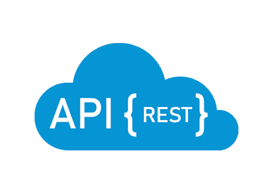

# REST_API

---

### Table of Contents

- [Description](#description)
- [How To Use](#how-to-use)
- [Author Info](#author-info)

---

## Description

A basic rest API using Node.js and Express.js to display google search trends

#### Technologies

- HTML
- BootStrap
- Node.JS
- Express.JS
- EJS

---

## How To Use

Navigate to the link \_\_. Here you will be able to view the current google trends.

---

## Author Info

- LinkedIn - [@StephenPalazzo](https://www.linkedin.com/in/stephenpalazzo)
- Website - [Stephen Palazzo](https://stephenpalazzo.com)

[Back To The Top](#REST_API)
